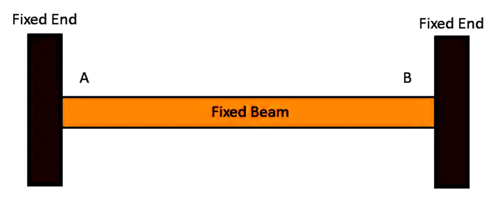
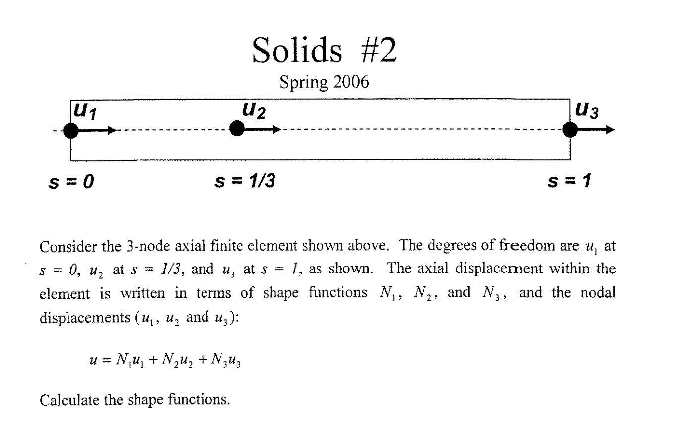

# NTA User Guide

NTA (Note Taking App) is a cross-platform markdown-based note taking application with advanced features for linking, embedding, and viewing various file types.

## Features

### Markdown Editing
- Full markdown support with live preview
- Syntax highlighting
- Math rendering with KaTeX (inline `$math$` and block `$$math$$`)

### Wiki Links
Create bidirectional links between notes using `[[Note Name]]` syntax.
- Autocomplete suggestions appear as you type
- Click links to navigate to referenced notes
- Backlinks show which notes reference the current one

### Hashtags
You can group ideas with '#' in front of the text. Ex. #idea
This will create an hashtag in the hashtags box on the bottom left, thus making it easier to find all the notes that have a similar topic.

### Embedded Content
Embed various file types directly in your notes:

#### Code block
An example with Python:
```python
import numpy as np
```
An example with C++:

```C++
return 0;
```

#### Images
```
![[examples/Cantilever Beam Image.png]]
```
![[Cantilever Beam Image]]

You can also hide that its from a different file with "!!"

!![[Cantilever Beam Image.png]]

#### Videos
```
![[examples/Sample Video.mp4]]
```

#### PDFs
```
![[examples/1Equations.pdf]]
```

#### HTML Files
```
![[examples/Equations.html]]
```


#### Notebooks

### LaTeX Support
Write mathematical equations using LaTeX syntax:
- Inline: $E = mc^2$
- Block:
$$
\frac{d}{dx} \int_a^x f(t) dt = f(x)
$$

### File Management
- Organize notes in folders
- Support for multiple file types: .md, .txt, .tex, .bib, .html, .pdf, .png, .jpg, .mp4, etc.
- Automatic file type detection

### PDF Viewer
Integrated PDF viewer for viewing and annotating PDF documents directly in the app.

### Citation Management
Support for BibTeX citations with automatic formatting.

### Export Options
Export notes to various formats including PDF, HTML, and DOCX.

## Getting Started

1. **Installation**: Download the appropriate version for your platform from the releases page.
2. **First Note**: Create a new markdown file and start writing.
3. **Linking**: Use `[[ ]]` to link to other notes or files.
4. **Embedding**: Use `![[ ]]` to embed content inline.

## Example Workflow

Here's a complete example using the provided sample files:

### Structural Analysis Notes

#### Euler-Bernoulli Beam Theory
The Euler-Bernoulli equation describes beam bending:

$$ EI \frac{d^2y}{dx^2} = M(x) $$

Where:
- $E$ is Young's modulus
- $I$ is the moment of inertia
- $M(x)$ is the bending moment



#### Finite Element Method (FEM)
FEM discretizes the continuum into finite elements.

![[FEM.md]]

Key concepts:
- Nodal displacements
- Element stiffness matrices
- Assembly process



#### Rayleigh-Ritz Method
An approximation method for solving differential equations.

![[Rayleigh-Ritz.md]]

The method minimizes the functional:

$$ \Pi = \int_0^L \frac{1}{2} EI \left(\frac{dy}{dx}\right)^2 dx - \int_0^L w(x)y dx $$

![[Rayleigh-Ritz part1]]
![[Rayleigh-Ritz part2]]

### References
For more detailed derivations, see:
- [[1Equations.pdf]]
- [[Beam Bending Recap.pdf]]

### Interactive Content
View the interactive html script:
![[Untitled.html]]

#### Inline Commands

You can also use shortcuts to create tables, quotes and matrices: 
In order to do so type '&matrix nxm' (substituting n and m with the size of the matrix you want) and press return

Ex.
&matrix 3x4
$$
\begin{matrix}
  a_{11} & a_{12} & a_{13} & a_{14} \\
  a_{21} & a_{22} & a_{23} & a_{24} \\
  a_{31} & a_{32} & a_{33} & a_{34} \\
  a_{41} & a_{42} & a_{43} & a_{44}
\end{matrix}
$$

You can use all the followings: 'matrix', 'bmatrix', 'pmatrix', 'Bmatrix', 'vmatrix', 'Vmatrix'

You can also crate a table prefilled with certain values the following way:'&table 4x4=0', for a matrix filled with 0s.
Ex.
&table 4x4 =0
| Header 1 | Header 2 | Header 3 | Header 4 |
| --- | --- | --- | --- |
| 0 | 0 | 0 | 0 |
| 0 | 0 | 0 | 0 |
| 0 | 0 | 0 | 0 |
| 0 | 0 | 0 | 0 |

If while filling out the table you notice that you filled it with the wrong value, no worries, you can change the value after the '=' and all the values that have not been modified will change to the new assigned value.

&table 4x4 =9
| Header 1 | Header 2 | Header 3 | Header 4 |
| --- | --- | --- | --- |
| 3 | 9 | 9 | 9 |
| 9 | 9 | 9 | 9 |
| 9 | 2 | 9 | 9 |
| 9 | 1 | 9 | 9 |

Try changing the value after the '='!

#### Code inline command
You can create a code block the following way:'&code python'
Ex.
&code python

```python
# python code
```

You can also change the language in the code by modifying the line that starts with '&' and pressing return.


#### Math inline command
Instead of having to type the tedious $$ math $$
you can use the inline command '&math' and press return:
Ex.
$$
\text{math here}
$$

## Keyboard Shortcuts

- `Ctrl+N`: New note
- `Ctrl+O`: Open file
- `Ctrl+S`: Save
- `[[`: Start wiki link (with autocomplete)

## Tips

- Placing the cursor at the end of a line will make it in-line render
- You can select just some parts of the text to render by clicking CMD+L
- You can sync the scrolling between the editor and the live preview with CMD+O
- By double-clicking on a piece of text in the live preview pane (right sidebar) you will be redirected where that piece of text is in the editor
- There are a few icons on top right for easier use
- Customize everything in the setting tab (bottom right)
- Use descriptive note names for better linking
- Organize related notes in folders
- Leverage the preview pane to see rendered content
- Use tags for categorization (though not implemented yet)
- You can export in 4 different formats: PDF, HTML, DOCX, EPUB. You can set a preference on a default export format and simply use CMD+E
- You can work on multiple files one next to the other by adding more panes (the '+' button on top right)
- The status bar (on the bottom of the app) can explain how inline commands work if the cursor is on the same line as one of them

## Troubleshooting

- If wiki links don't autocomplete, ensure the note exists in your workspace
- For PDF viewing issues, check that the file is not corrupted
- Math rendering requires valid LaTeX syntax

For more help, check the [GitHub repository](https://github.com/Maurone7/NTA) or create an issue